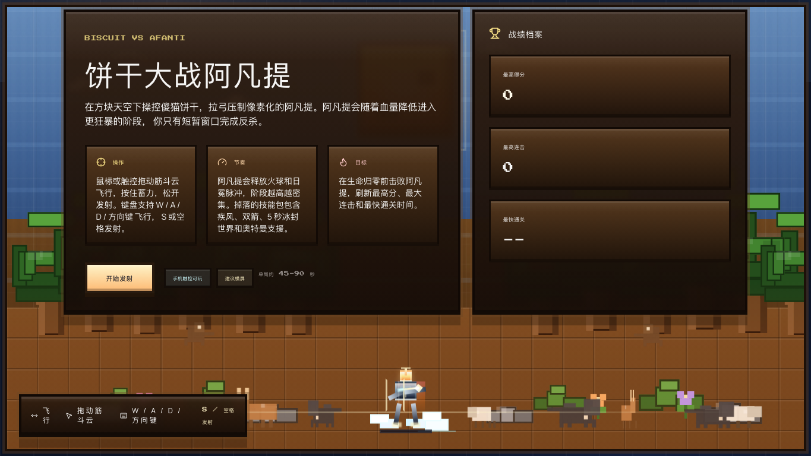
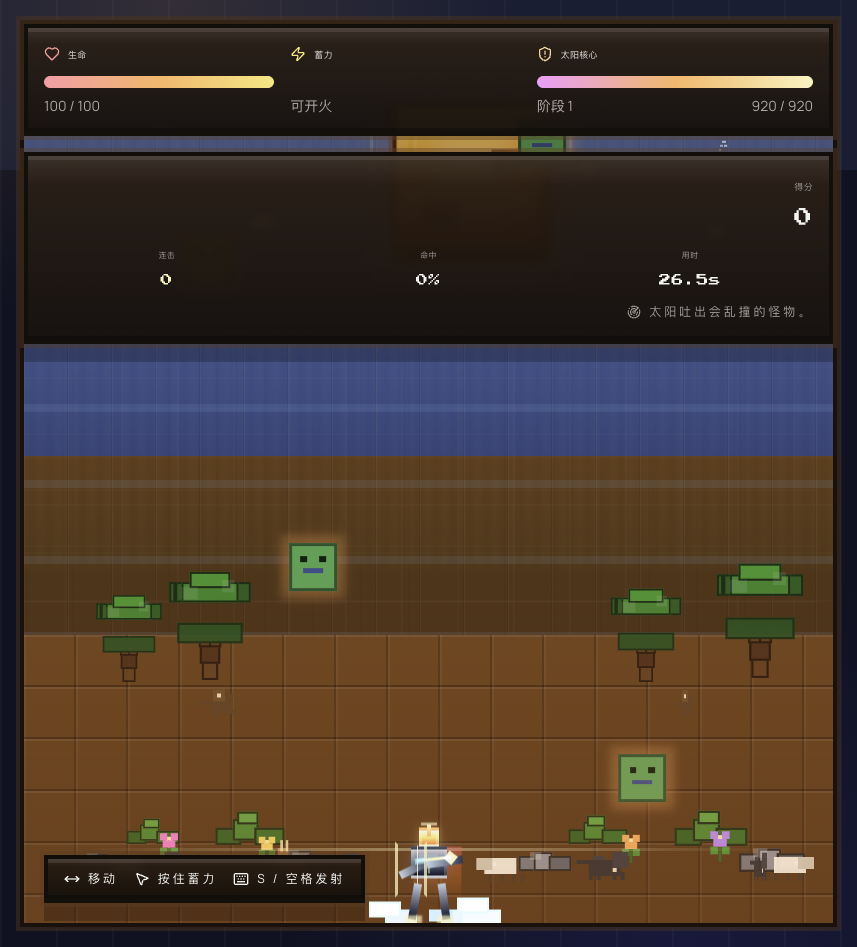
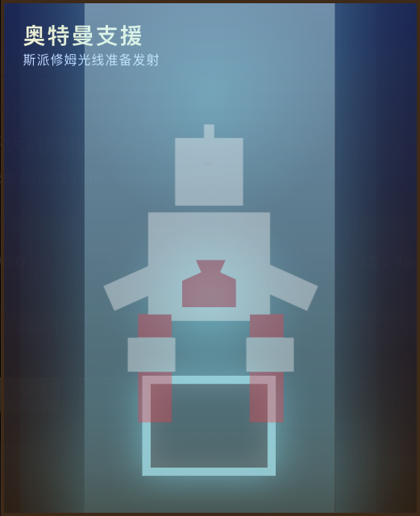
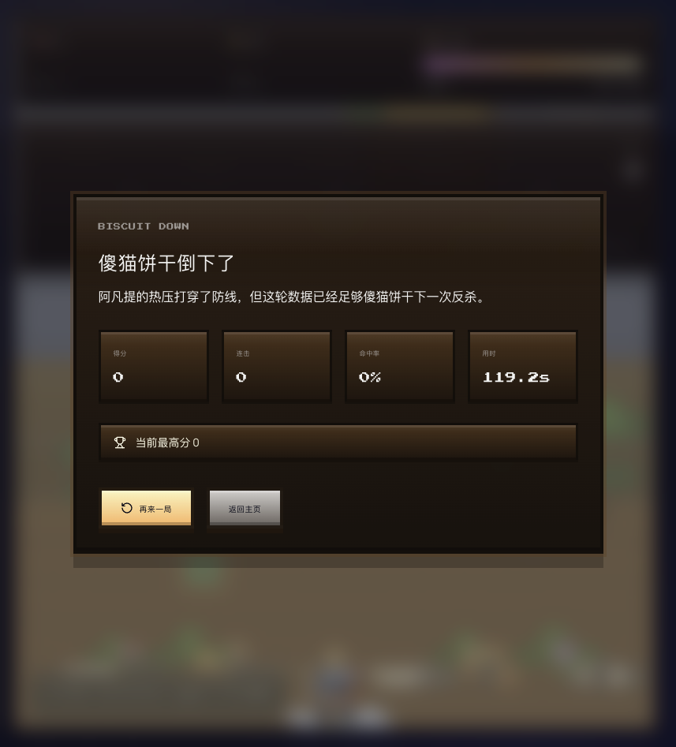

# 饼干大战阿凡提

一款偏像素方块风的网页动作小游戏。你要操控傻猫饼干在天空战场中移动、蓄力、发射，在自己生命归零之前击败不断狂暴化的阿凡提。

## 游戏画面

### 开始页

### 战斗中

### 怪物乱撞阶段

### 结算页

## 怎么玩

1. 点击“开始发射”进入战场。
2. 左右移动傻猫饼干，避开阿凡提放出的像素怪物。
3. 按住蓄力，松开发射箭矢，持续压低阿凡提血量。
4. 阿凡提血量越低，阶段越高，攻击会更密更凶。
5. 在生命值归零前击败阿凡提，尽量打出更高分、更高连击和更快通关时间。

## 操作方式

- 鼠标或触控左右移动。
- 键盘 `A / D` 左右移动。
- 键盘 `S` 或空格发射。
- 观察上方血条、蓄力条和阿凡提阶段提示，随时调整节奏。

## 得分与成长

- 命中阿凡提可以持续拿分。
- 连续命中能把分数滚得更快。
- 掉落物和技能包能帮助你打出更强节奏。
- 技能包包含加速和双箭，吃到后更容易打出爆发。

## 生存提示

- 不要只顾输出，先看怪物飞行路线。
- 怪物现在会从多方向飞来，还会在边界反弹。
- 阿凡提进入高阶段后，建议优先走位，再找蓄力窗口。
- 想刷新纪录，就要平衡命中、连击和生存时间。
